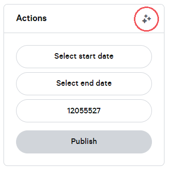
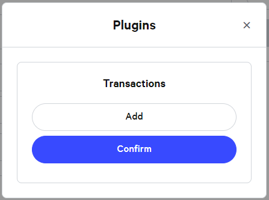
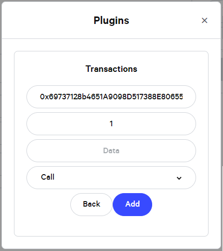
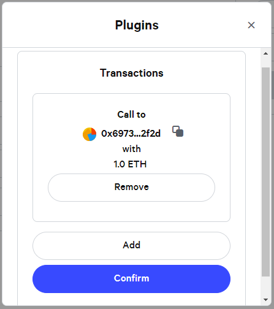

# SafeSnap Setup Guide

This guide shows how to setup the Reality module with a Gnosis Safe on the Rinkeby testnetwork. It will use [Realitio](https://realit.io/) and can be used with [Snapshot](https://snapshot.org/).

For more information on SafeSnap please refer to the [Gnosis blog](https://blog.gnosis.pm/ea67eb95c34f).

## Prerequisites

To start the process you need to create a Safe on the Rinkeby test network (e.g. via https://rinkeby.gnosis-safe.io). This Safe will represent the DAO and hold all the assets (e.g. tokens and collectibles). A Safe transaction is required to setup the Reality module.

For the hardhat tasks to work the environment needs to be properly configured. See the [sample env file](../.env.sample) for more information.

The guide will use the Rinkeby ETH Realitio contract at [`0x3D00D77ee771405628a4bA4913175EcC095538da`](https://rinkeby.etherscan.io/address/0x3D00D77ee771405628a4bA4913175EcC095538da#code). Other network addresses can be found in the truffle build folder on the [Realitio GitHub repo](https://github.com/realitio/realitio-contracts). E.g. on mainnet the ETH Realitio contract can be found at [`0x325a2e0f3cca2ddbaebb4dfc38df8d19ca165b47`](https://etherscan.io/address/0x325a2e0f3cca2ddbaebb4dfc38df8d19ca165b47#code).

DISCLAIMER: Check the deployed Realitio contracts before using them.

## Setting up the module

The first step is to deploy the module. Every DAO will have their own module. The module is linked to a DAO (called avatar in the contract) and an oracle (e.g. Realitio). These cannot be changed after deployment.

As part of the setup you need to define or choose a template on Realitio. More information can be found in [their docs](https://github.com/realitio/realitio-dapp#structuring-and-fetching-information) 

### Setup the Realitio template

To define your own template a hardhat task is provided in the repository. It is possible to provide a template to that task via `--template` else the [default template](../src/tasks/defaultTemplate.json) is used.

The template should have the following format:
```json
{
    "title": "Did the proposal with the id %s pass the execution of the transactions with hash 0x%s?",
    "lang": "en",
    "type": "bool",
    "category": "DAO proposal"
}
```

- It is important that the `type` is `bool` as the module expects the outcome reported by Realitio to be `true`, `false` or `INVALID`
- The `category` and `lang` can be freely choosen and are only used in the Realitio web interfaces
- The title will also be displayed in the Realitio web interface and MUST include two `%s` placeholders
  - The first placeholder is for the `id` of the proposal (e.g. a ipfs hash)
  - The second placeholder is the hash of the concatenation of the EIP-712 transaction hashes (see the [README](../README.md) for more information)
- IMPORTANT: The template should make it clear when and how to vote on your questions
  - An example can be found in the [🍯DAO requirements](https://cloudflare-ipfs.com/ipfs/QmeJwtwdG4mPzC8sESrW7zqixZqdHDYnREz6ar9GCewgz7/)
  - DISCLAIMER: DO NOT BLINDLY COPY THE REQUIREMENTS. You should check the requirements and make the adjustments for your setup.

Using this template you can run the task by using `yarn hardhat --network <network> createDaoTemplate --oracle <oracle address> --template <your template json>` and this should provide you with a template id.

An example for this on Rinkeby would be (using the default template):
`yarn hardhat --network rinkeby createDaoTemplate ---oracle 0x3D00D77ee771405628a4bA4913175EcC095538da`

For this guide we will assume that the returned template id is `0x0000000000000000000000000000000000000000000000000000000000000dad`

### Deploying the module

Hardhat tasks can be used to deploy a dao module instance. There are two different tasks, the first one is through a normal deployment and passing arguments to the constructor (with the task `setup`), or, deploy the Module through a [Minimal Proxy Factory](https://eips.ethereum.org/EIPS/eip-1167) and save on gas costs (with the task `factorySetup`) - In rinkeby the address of the Proxy Factory is: `0xd067410a85ffC8C55f7245DE4BfE16C95329D232` and the master copy of the Reality Module: `0x4D0D4Bd6eCA52f2F931c099B6a8a8B2ae85FFD4E`.

Now that we have a template, a hardhat task can be used to deploy a Reality module instance. These tasks requires the following parameters:

- `avatar` - the address of the avatar.
- `owner` - the address of the owner
- `oracle` - the address of the Realitio contract
- `template` - the template to be used with Realitio

There are also optional parameters, for more information run `yarn hardhat setup --help` or `yarn hardhat factory-setup --help`.

An example for this on Rinkeby would be:
`yarn hardhat --network rinkeby setup --owner <owner_address> --avatar <avatar_address> --oracle 0x3D00D77ee771405628a4bA4913175EcC095538da --template 0x0000000000000000000000000000000000000000000000000000000000000dad`

or

`yarn hardhat --network rinkeby factorySetup --factory <factory_address> --mastercopy <mastercopy_address> --owner <owner_address> --avatar <avatar_address> --oracle 0x3D00D77ee771405628a4bA4913175EcC095538da --template 0x0000000000000000000000000000000000000000000000000000000000000dad`

or

`yarn hardhat --network rinkeby factory-setup --factory <factory_address> --mastercopy <mastercopy_address> --dao <dao_address> --oracle 0x3D00D77ee771405628a4bA4913175EcC095538da --template 0x0000000000000000000000000000000000000000000000000000000000000dad`

This should return the address of the deployed Reality module. For this guide we assume this to be `0x4242424242424242424242424242424242424242`

Once the module is deployed you should verify the source code (Note: If you used the factory deployment the contract should be already verified). If you use a network that is Etherscan compatible and you configure the `ETHERSCAN_API_KEY` in your environment you can use the provided hardhat task to do this. 

An example for this on Rinkeby would be:
`yarn hardhat --network rinkeby verifyEtherscan --module 0x4242424242424242424242424242424242424242 --owner <owner_address> --avatar <avatar_address> --oracle 0x3D00D77ee771405628a4bA4913175EcC095538da --template 0x0000000000000000000000000000000000000000000000000000000000000dad`

### Enabling the module

To allow the Reality module to actually execute transaction it is required to enable it on the Safe that it is connected to. For this it is possible to use the Transaction Builder on https://rinkeby.gnosis-safe.io. For this you can follow our tutorial on [adding a module](https://help.gnosis-safe.io/en/articles/4934427-add-a-module).

## Snapshot integration

Once the module is setup it is possible to configure a space on [Snapshot](https://snapshot.org/) to enable the Reality module plugin. For this the space configuration needs to include `"plugins": { "daoModule": { "address": "<module_address>"} }`. An example for this can be found in the [🍯DAO space configuration](https://cloudflare-ipfs.com/ipfs/QmahDCSkdED9BLZ3VtH6aJ8P5TmvMYEfA7fJa4hGsvEpi2/).

Once your space is configured you can attach transactions to you proposals via the plugin section:

1. Open the plugin selection




2. Add Reality module plugin


3. Add Reality module transaction





4. Check preview of transactions


Once the proposal has been resolved it is possible to submit the proposal to the Reality module via the plugin. 

This can also be done via the hardhat tasks provided in this repository. For more information run `yarn hardhat addProposal --help` or `yarn hardhat executeProposal --help`.

Once the question is available it can be answered via the Realitio web interface (e.g. https://reality.eth.link/app/).

## Monitoring your module

As anyone can submit proposals to your module it is recommended to setup some monitoring. The Reality module relies on the oracle (e.g. Realitio) to provide the correct answer so that no malicious transactions are executed. In the worst case the avatar (e.g. the connected Safe) can invalidate a submitted proposal (see [README](../README.md) for more information). 

To make sure that all the involved stakeholders can react in a timely manner, the events emitted by the module contract should be monitored. Each time a new proposal is submitted the contract will emit a `ProposalQuestionCreated` event with the following parameters:
```
event ProposalQuestionCreated(
    bytes32 indexed questionId, // e.g. Realitio question id
    string indexed proposalId // e.g. Snapshot proposal id
);
```

There are different services available for this such as the [OpenZepplin Defender Sentinel](https://docs.openzeppelin.com/defender/sentinel).

### Deploy a master copy 

The master copy contracts can be deployed through `yarn deploy` command. Note that this only should be done if the DaoModule contracts gets an update and the ones referred on the (zodiac repository)[https://github.com/gnosis/zodiac/blob/master/src/factory/constants.ts] should be used.